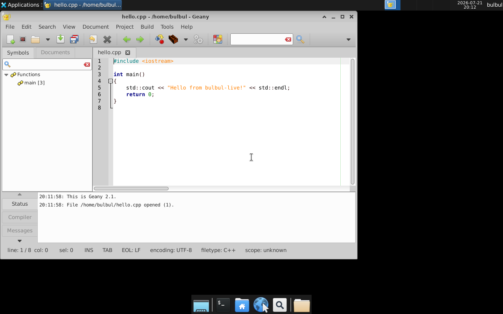
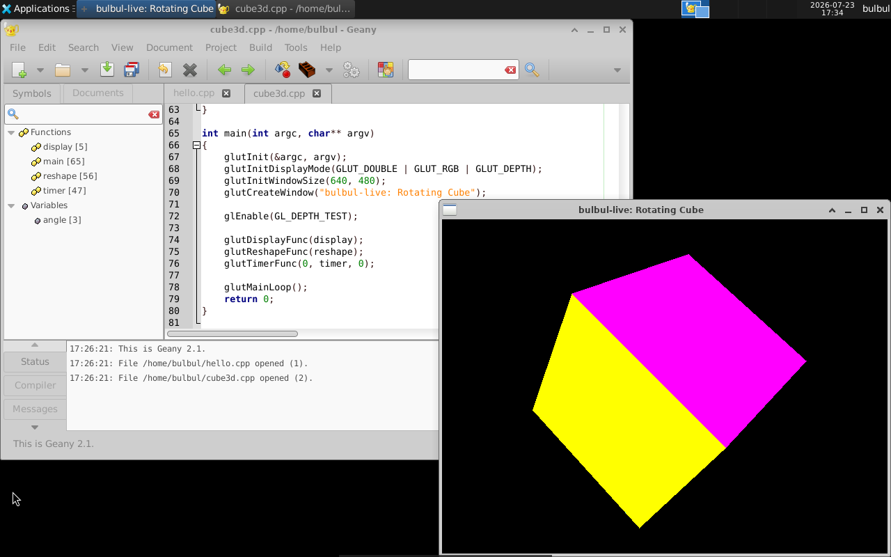

# 🐦 Bulbul OS Live

**A zero-install, boot-and-code Linux live environment for developers.**

Bulbul OS is a lightweight Debian/Ubuntu-based **live ISO** built with [`live-build`](https://live-team.pages.debian.net/live-manual/html/live-manual/index.en.html). Boot it from a USB stick or a virtual machine and you land straight on a ready-to-use XFCE desktop with a full C/C++ toolchain, an OpenGL/GLUT 3D graphics stack, and a code editor already installed — no setup, no installation, nothing to configure. Shut it down and it leaves no trace on the host machine.

Think of it as a **portable, disposable dev box**: plug in a USB drive (or boot a VM), start coding or experimenting with graphics programming in seconds, and walk away with the host system exactly as you found it.


---

## 🤔 Why does this exist?

Setting up a Linux box for C/C++ (and graphics) development from scratch — installing a distro, a desktop, a compiler, an editor, OpenGL drivers — is tedious busywork when all you want to do is *write and run some code*. Bulbul OS skips all of that: it's a single ISO that boots directly into a working desktop with everything already wired together, so you can go from "cold boot" to "compiling and rendering a 3D scene" in under a minute.

---

## 📸 Screenshots

**Desktop on first boot** — auto-login straight into a clean XFCE desktop:



**OpenGL/GLUT test** — the bundled `cube3d.cpp` sample, compiled and running live, rendering a rotating, per-face-colored 3D cube:



---

## ✨ Features

| | |
|---|---|
| 🖥️ **XFCE4 desktop** | Fast, lightweight desktop environment (panel, window manager, file manager, desktop icons) |
| 📝 **Geany editor** | A ready-to-use, syntax-highlighting code editor, one click away from the desktop icon or the Applications menu — sample projects (`hello.cpp`, `cube3d.cpp`) are waiting in the home folder |
| ⚙️ **GCC / G++ toolchain** | `build-essential` is pre-installed, so you can compile C/C++ the moment you boot |
| 🧊 **OpenGL / GLUT 3D graphics** | `freeglut3-dev` + Mesa are pre-installed — write and run real 3D/OpenGL programs out of the box, no driver hunting. Ships with a rotating-cube demo (`cube3d.cpp`) to prove it works |
| 💾 **Optional persistent storage** | Attach a disk image and files you save under `~/Persistent` survive a reboot — everything else still runs from RAM as usual |
| 🔓 **Passwordless auto-login** | Boots straight to the desktop as user `bulbul` — no login screen to click through |
| 💻 **Terminal included** | `xfce4-terminal` for anything the GUI doesn't cover |
| 💽 **Zero install, zero trace** | Runs entirely from RAM/media; nothing is written to the host disk (unless you opt into persistent storage) |

---

## 🚀 Quick Start — Run in QEMU

The fastest way to try Bulbul OS is inside [QEMU](https://www.qemu.org/), no real hardware or USB stick required.

> ℹ️ A pre-built `binary.iso` is **not** committed to this repository (it's ~1.8 GB — see [Building from Source](#-building-from-source)). Build it yourself first, or grab it from the [Releases](../../releases) page if one has been published.

```bash
qemu-system-x86_64 -cdrom binary.iso -m 2048 -smp 2
```

That's it — QEMU boots the ISO and you land on the XFCE desktop automatically.

### Or use the bundled `run.sh` helper

This repo ships a ready-made launcher that auto-detects KVM acceleration for you:

```bash
chmod +x run.sh
./run.sh                 # boots ./binary.iso
./run.sh /path/to/other.iso   # or point it at a different ISO
```

`run.sh` will use `-enable-kvm` automatically if `/dev/kvm` is accessible (near-instant boot), and cleanly falls back to software emulation (TCG) otherwise.

### Useful flags (manual `qemu-system-x86_64` invocation)

| Flag | Purpose |
|---|---|
| `-m 2048` | RAM for the VM (tested down to `1024` MB; 2048 MB is more comfortable) |
| `-smp 2` | Number of virtual CPU cores |
| `-enable-kvm` | **Linux hosts only** — hardware acceleration, boots in seconds instead of minutes |
| `-vnc :0` | Headless mode: serve the display over VNC (`localhost:5900`) instead of opening a window |
| `-nographic` | Serial-console-only mode, no graphical display at all (useful for quick boot smoke tests) |

Example with KVM acceleration on native Linux:

```bash
qemu-system-x86_64 -cdrom binary.iso -m 2048 -smp 2 -enable-kvm
```

> ⚠️ **No KVM available?** Without hardware acceleration QEMU falls back to software emulation (TCG), which is *significantly* slower — expect boot + full desktop startup to take a few minutes rather than seconds. This is normal, not a hang; just give it time.

---

## 🪟 Running from Windows via WSL

If you're on Windows, the easiest path is QEMU running *inside* WSL. Total beginner? Follow these steps exactly, in order.

### 1. Install WSL (if you haven't already)

Open PowerShell **as Administrator**:

```powershell
wsl --install -d Ubuntu
```

Reboot if prompted, then finish the Ubuntu first-run setup (create a username/password).

### 2. Install QEMU inside WSL

```bash
sudo apt update
sudo apt install -y qemu-system-x86
```

### 3. (Optional but recommended) Enable KVM acceleration

Software emulation works, but hardware acceleration is dramatically faster (a ~40 second boot instead of ~2-3 minutes). Inside WSL:

```bash
sudo usermod -aG kvm "$USER"
```

Then fully restart WSL from **PowerShell** (not just close the terminal window):

```powershell
wsl --terminate Ubuntu
```

Reopen your WSL terminal — `/dev/kvm` should now be usable, and `run.sh` will pick it up automatically.

### 4. Get `binary.iso` into your WSL filesystem

Either build it yourself (see [Building from Source](#-building-from-source)) or copy a pre-built ISO in, e.g.:

```bash
cp /mnt/c/Users/<you>/Downloads/binary.iso ~/bulbul-live/
cd ~/bulbul-live
```

> 💡 Keep the ISO on the Linux (`ext4`) side of WSL, not under `/mnt/c/...` — disk I/O is much faster there, which matters a lot for a live ISO.

### 5. Boot it

```bash
chmod +x run.sh
./run.sh
```

- **Windows 11 (WSLg):** the QEMU window just pops up on your Windows desktop like a normal app — nothing else to configure.
- **Windows 10 / no WSLg:** run plain QEMU with `-vnc :0` instead, then connect a VNC client (e.g. [TightVNC](https://www.tightvnc.com/), [RealVNC](https://www.realvnc.com/)) from Windows to `localhost:5900`.

```bash
qemu-system-x86_64 -cdrom binary.iso -m 2048 -smp 2 -vnc :0
```

---

## 💿 Writing to a Real USB Drive

You can boot Bulbul OS on real hardware from a USB stick.

> ⚠️ **Current limitation:** this image is built with `--binary-images iso` (a CD/DVD-style ISO), not a true hybrid ISO yet (see [Roadmap](#-roadmap)). That means a raw `dd` write isn't guaranteed to boot on every machine — a proper USB-flashing tool that rebuilds the boot structure is the reliable option for now.

**Recommended — Windows/macOS/Linux, GUI:**

1. Download [Rufus](https://rufus.ie/) (Windows) or [balenaEtcher](https://etcher.balena.io/) (Windows/macOS/Linux).
2. Select `binary.iso` as the source and your USB drive as the target.
3. Write, then reboot the target PC and select the USB drive from the boot menu (BIOS/UEFI boot menu key, commonly `F12`, `F10`, `Esc`, or `Del`).

**Linux/macOS, command line (advanced, know your device node!):**

```bash
# Double- and triple-check /dev/sdX — this is destructive and irreversible.
sudo dd if=binary.iso of=/dev/sdX bs=4M status=progress conv=fsync
sync
```

---

## 🔑 Default Login

Bulbul OS auto-logs-in on boot, so you shouldn't need this — but for reference:

| User | Password |
|---|---|
| `bulbul` | *(none — passwordless account)* |
| `root` | `bulbul` |

This is intended strictly for a disposable, ephemeral live session — **do not** treat these as secure credentials for a persistent install.

---

## 🧪 Try it yourself: compiling the 3D cube demo

Once booted, open a terminal (`xfce4-terminal` from the panel/dock) and run:

```bash
g++ ~/cube3d.cpp -o ~/cube3d -lGL -lGLU -lglut
~/cube3d
```

You should see a window with a spinning, multi-colored cube — a quick sanity check that the OpenGL/GLUT stack is fully functional. Or just open `~/cube3d.cpp` / `~/hello.cpp` in Geany (desktop icon or Applications menu) and build from there.

---

## 💾 Persistent Storage

By default, Bulbul OS is fully RAM-based: turn it off and every file you created is gone. If you'd rather keep your work between boots, attach a small virtual disk and it'll be auto-formatted (first use) and auto-mounted at `~/Persistent` on every boot from then on — nothing else on the system persists, only that one folder.

### 1. Create the disk (once)

```bash
qemu-img create -f qcow2 persist.qcow2 5G
```

This creates a 5 GB **sparse** file (it starts at a few hundred KB on disk and only grows as you actually write data into it — it won't eat 5 GB up front).

### 2. Boot with `run.sh`

```bash
./run.sh
```

`run.sh` automatically looks for `persist.qcow2` next to itself and attaches it as a virtio disk if it's there — no flags needed. On first boot it gets formatted (ext4) automatically; every boot after that it's just mounted as-is. You'll see this in the launcher output:

```
Persist: /home/ahmet_blbl/bulbul-live/persist.qcow2 (guest icinde /home/bulbul/Persistent altina otomatik mount edilir)
```

Save anything you want to keep under **`~/Persistent`** in the live session. Files saved anywhere else (Desktop, `~/Downloads`, etc.) still vanish on shutdown, exactly like before.

> 💡 Want a bigger or smaller disk, or to keep it somewhere else? `qemu-img create -f qcow2 <path> <size>` with any size/path, then point `run.sh` at it with `QEMU_PERSIST_IMG=<path> ./run.sh`.

### How it works

A small systemd service (`bulbul-persist.service`, installed by `config/hooks/0040-persistent-storage.chroot`) runs very early at boot, before the desktop starts:

1. Waits for the virtio disk (identified by a stable `serial=bulbulpersist` tag, so it doesn't matter what device node the kernel assigns it).
2. If the disk has no filesystem yet (a brand-new `persist.qcow2`), formats it with ext4.
3. Mounts it at `/home/bulbul/Persistent` and hands ownership to the `bulbul` user.

If no disk is attached, the service just exits immediately and the system behaves exactly like the fully-RAM-based default — persistence is entirely opt-in.

---

## 🔨 Building from Source

This repository contains the [`live-build`](https://live-team.pages.debian.net/live-manual/html/live-manual/index.en.html) configuration used to produce `binary.iso` — the ISO itself isn't tracked in git (it's ~1.8 GB of compiled/downloaded packages, not source).

**Requirements:** a Debian/Ubuntu machine or WSL Ubuntu instance, `live-build` installed, and a decent chunk of free disk space (~10 GB) and time (package downloads + squashfs compression).

```bash
sudo apt update
sudo apt install -y live-build

git clone https://github.com/ahmetcevdetbulbul/bulbul-live-os.git
cd bulbul-live-os

sudo lb build
```

When it finishes, `binary.iso` will be sitting in the project root, ready to boot with QEMU or flash to a USB drive.

To clean up and start fresh:

```bash
sudo lb clean --all
```

---

## 🧰 Tech Stack

- **[live-build](https://live-team.pages.debian.net/live-manual/html/live-manual/index.en.html)** — the Debian Live Systems build toolchain
- **Ubuntu 26.04 "resolute"** (amd64) — base distribution
- **[casper](https://gitlab.com/ubuntu-live/casper)** — live-session boot machinery (auto-login, live user creation)
- **GRUB 2** — bootloader
- **[XFCE4](https://www.xfce.org/)** — desktop environment
- **[LightDM](https://github.com/canonical/lightdm)** — display/login manager
- **[Geany](https://www.geany.org/)** — lightweight IDE/text editor
- **GCC / G++** (`build-essential`) — C/C++ compiler toolchain
- **OpenGL / Mesa / FreeGLUT** (`freeglut3-dev`, `mesa-utils`) — 3D graphics programming stack

---

## 🤝 Contributing / Developing

Contributions, bug reports, and suggestions are welcome.

1. **Fork** the repo and create a branch for your change.
2. Edit the relevant `live-build` config:
   - `config/package-lists/live.list.chroot` — add/remove packages
   - `config/hooks/*.chroot` — scripts that run inside the chroot during build (users, auto-login, sample files, persistent-storage service)
   - `config/includes.chroot/` — files copied verbatim into the live filesystem
3. Rebuild and test:
   ```bash
   sudo lb clean --binary && sudo lb build
   ./run.sh
   ```
4. Open a **pull request** describing what changed and why. Screenshots/screen recordings of the change in action are always appreciated.

If you're only iterating on hooks/package-lists (not the bootloader or initramfs), you don't need a full `lb clean --all` between attempts — see the comments in `auto/build` and `config/hooks/` for the faster incremental workflow.

---

## 🗺️ Roadmap

- [ ] **Python 3** development tooling
- [ ] **Java / OpenJDK**
- [ ] **VS Code** (or a lighter alternative code editor option)
- [ ] Hybrid ISO output (`--binary-images iso-hybrid`) for reliable `dd`-to-USB booting on all firmware types
- [x] Persistent storage option (save work across reboots) — see [Persistent Storage](#-persistent-storage)
- [ ] Published pre-built ISO releases

Contributions and suggestions are welcome — feel free to open an issue.

---

## 📁 Project Structure

```
bulbul-live/
├── auto/                    # live-build's build/clean/config entry-point scripts
├── config/
│   ├── package-lists/       # Package selection (live.list.chroot)
│   ├── hooks/                # Post-install chroot hooks (users, auto-login, sample code, initramfs)
│   ├── includes.chroot/      # Files copied verbatim into the live filesystem
│   └── templates/            # Custom GRUB template, etc.
├── run.sh                   # QEMU launcher: KVM auto-detect + optional persistent disk
├── persist.qcow2            # Optional persistent-storage disk (gitignored, create it yourself)
└── docs/
    ├── screenshot.png
    └── cube3d.png
```

---

## 📄 License

No license has been chosen for this project yet.
